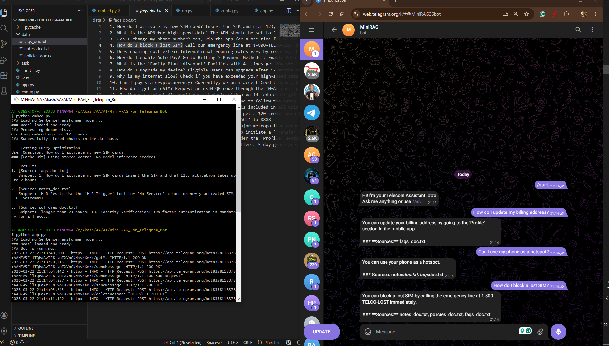

#  Telecom RAG Telegram Bot

An AI-powered Telegram assistant built using a **Retrieval-Augmented Generation (RAG)** architecture.  
The bot answers telecom-related queries using local documents, maintains short-term conversation memory, and uses SQLite for efficient vector storage and caching.

---

##  Features

-  **Document Retrieval** – Searches local `.txt` files for relevant context  
-  **Conversation Memory** – Keeps last 2–3 interactions  
-  **Query Caching** – Stores embeddings in SQLite for faster responses  
-  **Portable Design** – Uses `.env` and relative paths  
-  **Source Transparency** – Shows source documents in answers  

---

##  Project Structure

Mini-RAG_For_Telegram_Bot/

├── data/

├── app.py

├── rag2.py

├── embed.py

├── db.py

├── config.py

├── .env

└── requirements.txt

---

##  Setup Instructions

### 1. Clone the repo, or you can download and unzip it
git clone https://github.com/Akash671/Mini-RAG_For_Telegram_Bot.git
cd Mini-RAG_For_Telegram_Bot  

### 2. Create Virtual Environment
python -m venv venv  

Activate:  
Windows: venv\Scripts\activate  
Mac/Linux: source venv/bin/activate  

### 3. Install Dependencies
pip install -r requirements.txt  

---

##  Environment Variables

Create `.env` file:

HF_API_TOKEN=your_huggingface_token  
TELEGRAM_TOKEN=your_telegram_bot_token  

---

##  Configuration

Update vector DB path (`config.py`)
VEC0_PATH = r"C:\Users\YOUR_USERNAME\...\sqlite_vec\vec0.dll"

Update data path (`embed.py`)
raw_data_folder_path = r"C:\path\to\data"

---

##  Usage

Step 1: Embed Documents  
python embed.py  

Step 2: Run Bot  
python app.py  

---

##  Commands

/start – Start bot  
/ask <question> – Ask query  
/clear – Reset chat history  

---

##  How It Works

1. User sends a query from the telegram bot
2. System checks cache  
3. Converts query → embedding  (using all-MiniLM-L6-v2 embedding model from huggingface)
4. Retrieves top chunks from DB  
5. Builds prompt + history  
6. Sends to LLM (using meta-llama/Llama-3.2-1B-Instruct Model from huggingface)
7. Returns answer + sources  

---

##  Demo

---

##  License

MIT License  

---

##  Author

Akash
